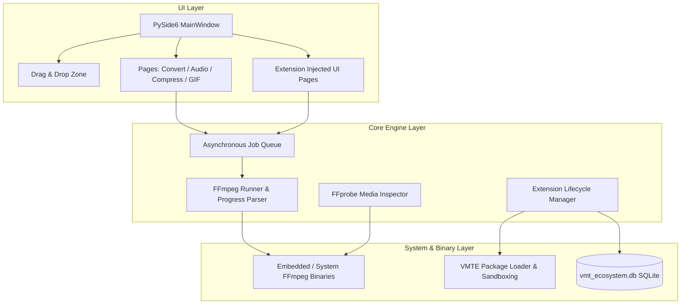

# Architecture — VMT (Video Media Toolkit)

```mermaid
flowchart TD
    subgraph UI Layer
        MainWindow[PySide6 MainWindow]
        DropZone[Drag & Drop Zone]
        Pages[Pages: Convert / Audio / Compress / GIF]
        ExtUI[Extension Injected UI Pages]
    end

    subgraph Core Engine Layer
        JobQueue[Asynchronous Job Queue]
        FFmpegRunner[FFmpeg Runner & Progress Parser]
        FFprobe[FFprobe Media Inspector]
        ExtLifecycle[Extension Lifecycle Manager]
    end

    subgraph System & Binary Layer
        FFmpegBin[Embedded / System FFmpeg Binaries]
        ExtLoader[VMTE Package Loader & Sandboxing]
        DB[(vmt_ecosystem.db SQLite)]
    end

    MainWindow --> DropZone
    MainWindow --> Pages
    MainWindow --> ExtUI
    Pages --> JobQueue
    ExtUI --> JobQueue
    JobQueue --> FFmpegRunner
    FFmpegRunner --> FFmpegBin
    FFprobe --> FFmpegBin
    ExtLifecycle --> ExtLoader
    ExtLifecycle --> DB
```
