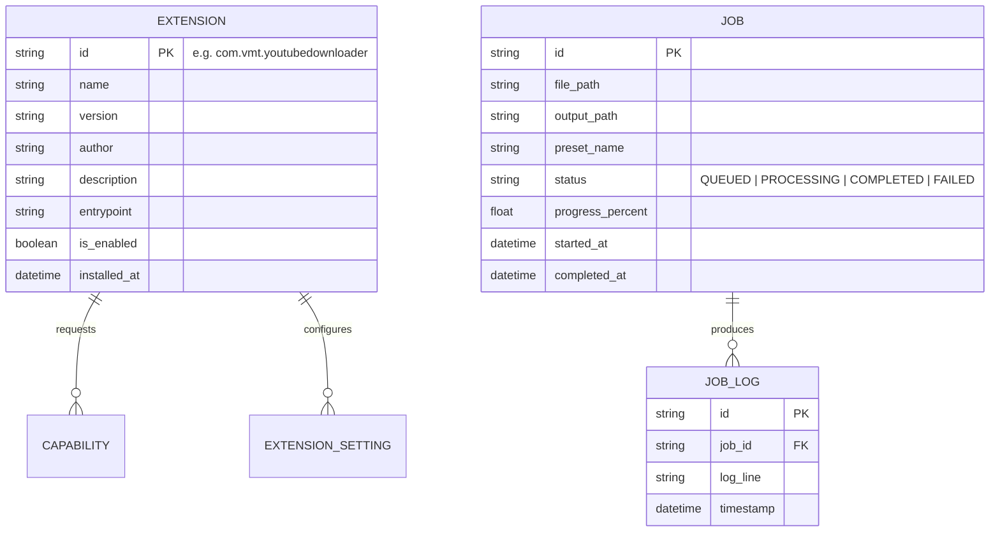

# Data Model & Schemas — VMT

```mermaid
erDiagram
    EXTENSION ||--o{ CAPABILITY : requests
    EXTENSION ||--o{ EXTENSION_SETTING : configures
    JOB ||--o{ JOB_LOG : produces

    EXTENSION {
        string id PK "e.g. com.vmt.youtubedownloader"
        string name
        string version
        string author
        string description
        string entrypoint
        boolean is_enabled
        datetime installed_at
    }

    JOB {
        string id PK
        string file_path
        string output_path
        string preset_name
        string status "QUEUED | PROCESSING | COMPLETED | FAILED"
        float progress_percent
        datetime started_at
        datetime completed_at
    }

    JOB_LOG {
        string id PK
        string job_id FK
        string log_line
        datetime timestamp
    }
```
