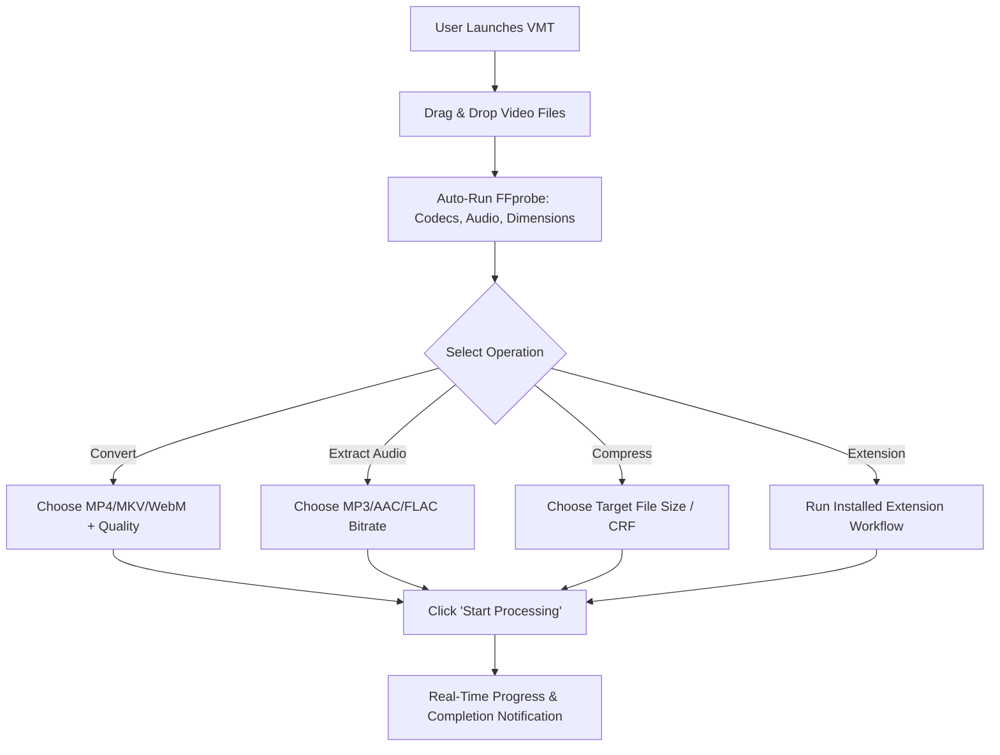

# User Flows — VMT

```mermaid
flowchart TD
    Launch[User Launches VMT] --> Ingest[Drag & Drop Video Files]
    Ingest --> Inspect[Auto-Run FFprobe: Codecs, Audio, Dimensions]
    Inspect --> SelectTab{Select Operation}
    SelectTab -->|Convert| ConvertTab[Choose MP4/MKV/WebM + Quality]
    SelectTab -->|Extract Audio| AudioTab[Choose MP3/AAC/FLAC Bitrate]
    SelectTab -->|Compress| CompressTab[Choose Target File Size / CRF]
    SelectTab -->|Extension| ExtPage[Run Installed Extension Workflow]
    ConvertTab --> StartQueue[Click 'Start Processing']
    AudioTab --> StartQueue
    CompressTab --> StartQueue
    ExtPage --> StartQueue
    StartQueue --> Monitor[Real-Time Progress & Completion Notification]
```
